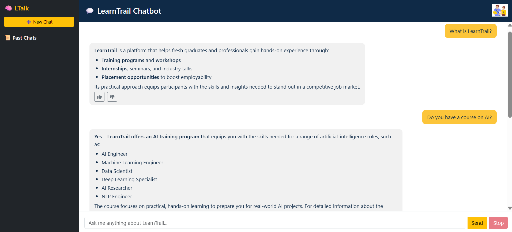
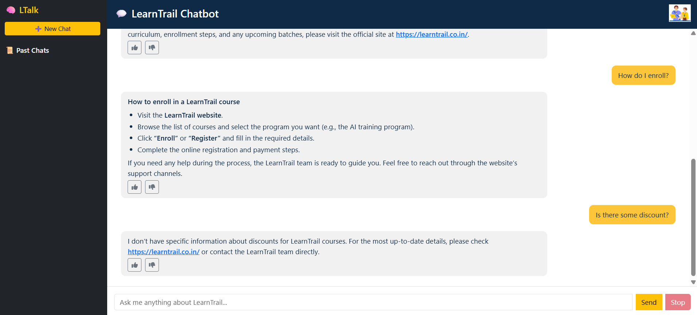
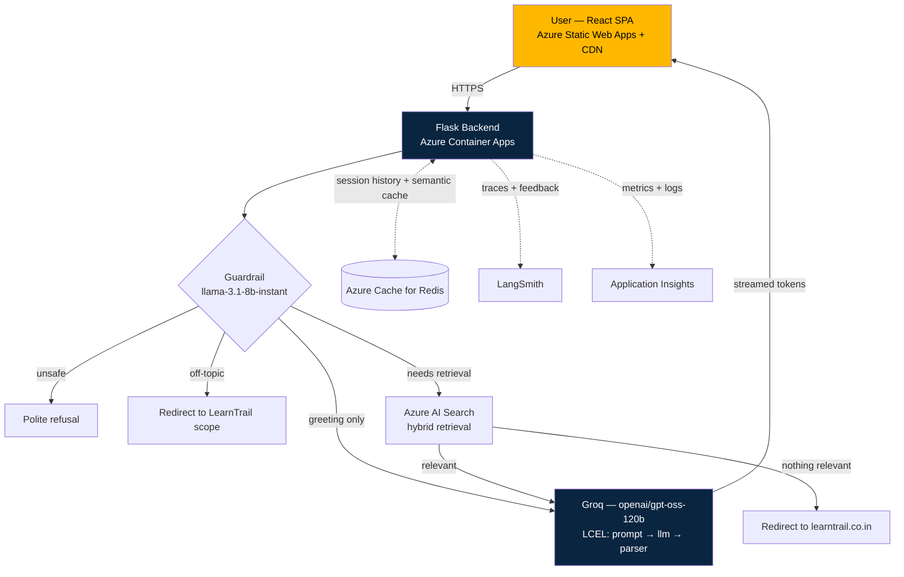

# LTalk: LearnTrail RAG Chatbot

A production-deployed Retrieval-Augmented Generation chatbot for **LearnTrail**, built to answer questions about its courses, programs, and career services - grounded strictly in a curated knowledge base, with explicit guardrails against off-topic use and hallucination.

🔗 **[Live Demo](https://polite-tree-016851b10.azurestaticapps.net)**



Live example of the app declining to guess rather than fabricate an answer:



---

## Why this project

Most RAG demos stop at "retrieve some chunks, ask an LLM." This one is built the way a small production service actually needs to work: it has to run on multiple concurrent workers without losing state, degrade safely when a component fails, resist prompt injection and off-topic misuse, avoid inventing facts it doesn't have, and be observable enough to actually debug in production.

Several real bugs were found and fixed during development (not simulated for this README) - see [Engineering Highlights](#engineering-highlights) for the specifics, since *how* they were found and fixed is a better signal of engineering ability than a clean success story would be.

---

## Architecture



Guardrail classification and the retrieval-gate lookup run **concurrently** (not sequentially). Neither depends on the other's result, so overlapping them removes one full round-trip of latency from every request.

---

## Key Features

### Retrieval & Generation
- **LCEL pipeline** (`prompt | llm | StrOutputParser`) - no legacy `RetrievalQA` chain; composable, streamable, and easy to reason about.
- **Single retrieval per request** - an earlier version retrieved twice (once for a relevance gate, once inside the generation chain); consolidated into one call that serves both.
- **Token-by-token streaming** over a persistent background event loop, avoiding the "Event loop is closed" failure that throwaway per-request loops cause with async clients that cache sessions (Azure Search's async transport, notably).
- **Chat history** via `RunnableWithMessageHistory`, Redis-backed with a 7-day TTL — survives across multiple gunicorn workers and Container Apps replicas, unlike an in-process dict.

### Guardrails (not a keyword list)
- A single fast LLM call (`llama-3.1-8b-instant`) classifies every incoming message for **safety** (prompt injection, abuse), **scope** (is this actually about LearnTrail?), and **retrieval need** (plain greeting vs. real question) — before any retrieval or generation happens.
- Replaced an earlier keyword-substring approach that had a real bug: `"hi" in query.lower()` matches *"**Wh**i**ch** mango is better?"* because `"hi"` is a substring of `"which"`. Any hardcoded short-keyword list has this failure mode.
- **Strict grounding rule** in the system prompt: the model is explicitly forbidden from stating specific facts (prices, dates, steps) not present in retrieved context, and redirects to `https://learntrail.co.in/` when its knowledge base doesn't cover something - see the second screenshot above for this working correctly on a real query that previously caused fabrication.

### Caching
- **Semantic** LLM response cache (Redis-backed, embedding-similarity match — not exact string match), so paraphrased repeat questions still hit cache. Hand-rolled rather than adopting `redisvl`'s vector search, since brute-force cosine similarity in Python is simpler and sufficient at this app's scale.
- Hit/miss/exact/semantic counters exposed via `/health`.

### Resilience & Production Practices
- **Fail-fast config validation** at startup (`config.py`) - a missing environment variable raises immediately with a clear message, instead of surfacing three requests later as a cryptic SDK error.
- **Structured JSON logging**, queryable in Application Insights / Log Analytics rather than grepped from stdout.
- **Redis-backed rate limiting** on `/ask` and `/feedback` - correctly shared across every worker/replica, not reset per-process.
- **Graceful degradation**: a guardrail classification failure defaults to a safe redirect rather than a raw 500 error reaching the user.
- **CORS scoped to the actual frontend origin** - not left open to any origin.

### User-Facing
- Real-time streaming responses with markdown rendering (`react-markdown`), auto-scroll, and a locked viewport layout so the input bar stays pinned regardless of message length.
- Thumbs up/down feedback on every generated response, linked to its LangSmith trace via `run_id`.
- Per-session chat history in the sidebar, each with its own isolated backend session.

---

## Evaluation & Model Selection

A RAGAS-based evaluation harness compares candidate models — Groq's `openai/gpt-oss-120b` against Azure OpenAI's `gpt-4.1-mini` — against a hand-built, 35-question evaluation set spanning five deliberate test categories:

| Test type | What it checks |
|---|---|
| `paraphrase` | Robustness to rephrased questions |
| `multi_hop` | Whether `k=3` retrieval is sufficient when an answer spans multiple KB entries |
| `distractor_precision` | Whether retrieval picks the *correct* chunk over topically-similar decoys |
| `consistency_check` | Cases where the static KB may be stale vs. the live site |
| `kb_gap` | Questions the KB genuinely can't answer — the direct hallucination-resistance test |

Metrics: RAGAS `faithfulness`, `answer_relevancy`, `context_precision`, `context_recall`, plus a custom deterministic ID-based retrieval check (exact source-row matching via metadata tagging) and a two-tier abstention-accuracy check for `kb_gap` rows. The evaluation judge (`llama-3.3-70b-versatile`) is deliberately a third, independent model from both candidates, to avoid a model partially grading its own output.

> **Status**: the harness is complete and has been validated end-to-end; a full clean run is pending — Groq's free-tier rate limits (both daily and per-minute token caps) have interrupted full runs mid-evaluation. The harness itself, including the throttling fix (`RunConfig(max_workers=2)`), is production-ready; a completed results table will be added here once a full run finishes without throttling interference.

---

## Tech Stack

| Layer | Technology |
|---|---|
| Frontend | React, Bootstrap, react-markdown, Font Awesome |
| Backend | Flask, Gunicorn (gthread workers) |
| Orchestration | LangChain (LCEL), LangGraph-style guardrail routing |
| LLMs | Groq (`openai/gpt-oss-120b`, `llama-3.1-8b-instant`, `llama-3.3-70b-versatile`), Azure OpenAI (`gpt-4.1-mini`) |
| Retrieval | Azure AI Search (hybrid), `sentence-transformers/all-mpnet-base-v2` |
| State | Azure Cache for Redis (chat history, semantic cache, rate limiting) |
| Evaluation | RAGAS |
| Observability | LangSmith (LLM traces + feedback), Application Insights (infra metrics, OpenTelemetry) |
| Deployment | Docker (multi-stage, CPU-only torch), Azure Container Registry, Azure Container Apps, Azure Static Web Apps (CDN) |
| CI/CD | GitHub Actions (frontend, auto-provisioned by Static Web Apps) |

---

## Engineering Highlights

A few real issues found and fixed during development, kept here because they're a better demonstration of debugging ability than a clean narrative would be:

- **Retrieval-wrapper async bug**: `AzureSearch.as_retriever()`'s async path in `langchain-community` passes `k` both explicitly and again via `**search_kwargs`, raising `TypeError: got multiple values for keyword argument 'k'` under `.astream()`. Fixed by calling the vectorstore's search method directly, bypassing the buggy wrapper.
- **Event loop lifecycle bug**: creating a new `asyncio` event loop per Flask request broke on the *second* request, because Azure Search's async client caches an `aiohttp` session tied to the first (now-closed) loop. Fixed with a single persistent background event loop for the app's lifetime, with per-request work submitted via `run_coroutine_threadsafe`.
- **Hallucination incident**: the system prompt's "always respond helpfully, even without context" instruction caused the model to fabricate specific course fees and enrollment dates not present in the knowledge base. Root-caused to the prompt itself (not a model or retrieval failure) and fixed with an explicit grounding rule forbidding unsupported specifics.
- **Docker build bug**: `pip install --user` packages were copied to a non-root user's home directory, but the model-baking `RUN` step executed as root *before* the `USER` switch — root's Python looked in its own home directory and found nothing. Fixed by using a venv at a fixed path, independent of any user's home directory.

---

## Local Setup

```bash
# Backend
cd backend
python -m venv venv && source venv/bin/activate
pip install -r requirements.txt
python ingest.py --recreate-index    # builds the Azure AI Search index
python app.py

# Frontend
cd frontend
npm install
npm start
```

Requires a `.env` (backend) with Azure AI Search, Redis, Groq, Azure OpenAI, and LangSmith credentials. See `config.py` for the full list of required/optional variables.

## Deployment

```bash
docker build -t learntrail-backend .
docker run -p 5000:5000 --env-file .env learntrail-backend   # verify locally first
```

Then: push to Azure Container Registry → deploy to Azure Container Apps (backend) and Azure Static Web Apps (frontend). Full environment variable list and step-by-step deployment notes are in the backend's `config.py` and this repo's commit history.

---
